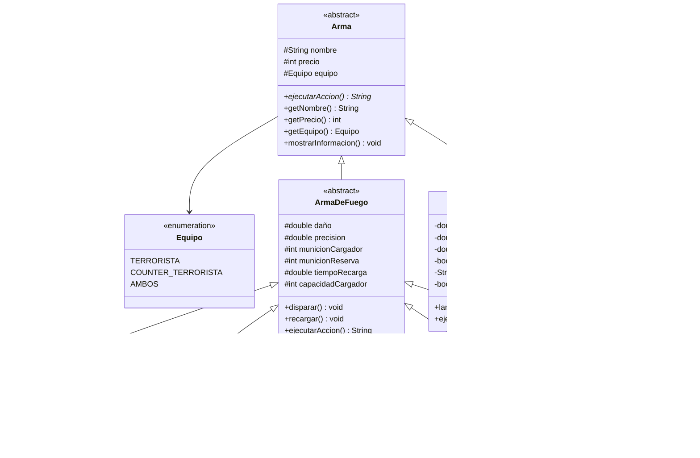

# menciso-tp-lp3-2026

Taller de Git y Modelado Orientado a Objetos - Lenguaje de Programación 3 (2026).
Dominio: Counter-Strike 2 (CS2).

## Diagrama de Clases (Mermaid)

```mermaid
classDiagram
    class Arma {
        <<abstract>>
        #String nombre
        #int precio
        #Equipo equipo
        +ejecutarAccion()* String
        +getNombre() String
        +getPrecio() int
        +getEquipo() Equipo
        +mostrarInformacion() void
    }

    class Equipo {
        <<enumeration>>
        TERRORISTA
        COUNTER_TERRORISTA
        AMBOS
    }

    class ArmaDeFuego {
        <<abstract>>
        #double daño
        #double precision
        #int municionCargador
        #int municionReserva
        #double tiempoRecarga
        #int capacidadCargador
        +disparar() void
        +recargar() void
        +ejecutarAccion() String
    }

    class Pistola {
        -boolean esSilenciada
        +alternarSilenciador() void
        +ejecutarAccion() String
    }

    class Granada {
        -double daño
        -double radioExplosion
        -double tiempoActivacion
        -boolean esLetal
        -String efecto
        -boolean lanzada
        +lanzar() void
        +ejecutarAccion() String
    }

    class RifleAsalto {
        +dispararRafaga() void
    }

    class Subfusil {
        +disparoRapido() void
    }

    class Francotirador {
        -boolean miraDesplegada
        +apuntarConMira() void
    }

    class Escopeta {
        -int perdigonesPorDisparo
    }

    Arma <|-- ArmaDeFuego
    Arma <|-- Granada
    ArmaDeFuego <|-- Pistola
    ArmaDeFuego <|-- RifleAsalto
    ArmaDeFuego <|-- Subfusil
    ArmaDeFuego <|-- Francotirador
    ArmaDeFuego <|-- Escopeta
    Arma --> Equipo
```
