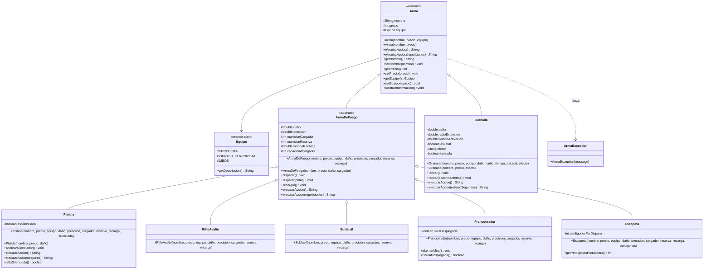

# menciso-tp-lp3-2026

**Asignatura:** Lenguaje de Programación 3 (CYT646) — Edición 2026  
**Ejercicio:** POO-06 (Revisión, paquetes, constructores y sobrecarga)  
**Dominio:** Counter-Strike 2 (CS2)  
**Autor:** Matias Enciso  
**Licencia:** [Apache License 2.0](LICENSE)  

---

## 1. Diagrama de Clases (Mermaid)

El siguiente diagrama refleja la jerarquía y estructura de clases bajo el paquete `py.edu.uc.lp3.me.cs2.domain`:



---

## 2. Sobrecarga vs. Sobreescritura

En cumplimiento con la rúbrica POO-06, a continuación se detallan las diferencias conceptuales y las implementaciones concretas realizadas en el código:

### Cuadro Comparativo

| Criterio | Sobrecarga (*Overloading*) | Sobreescritura (*Overriding*) |
| :--- | :--- | :--- |
| **Definición** | Mismo nombre de método o constructor con **diferente lista de parámetros** (tipo, cantidad u orden). | Reimplementación de un método en una clase hija con la **misma firma exacta** declarada en la clase padre. |
| **Ámbito** | En la misma clase o a través de la jerarquía. | Entre clases relacionadas por herencia (`extends` / `implements`). |
| **Resolución** | En **tiempo de compilación** (*Enlace estático / Static Binding*). | En **tiempo de ejecución** (*Despacho dinámico / Dynamic Binding* - Polimorfismo). |
| **Anotación** | No utiliza anotación. | Se documenta obligatoriamente con `@Override`. |

---

### Cambios Aplicados en el Proyecto

#### A. Sobreescritura (*Overriding*)
* **Método Abstracto Base:** En `Arma`, se definió el método abstracto `public abstract String ejecutarAccion();`.
* **Implementación en Hijas Independientes:**
  * **`Pistola`:** Sobreescribe `ejecutarAccion()` gestionando el consumo del cargador balístico y reportando si el disparo fue silenciado (*Pffft*) o normal (*¡PUM!*).
  * **`Granada`:** Sobreescribe `ejecutarAccion()` gestionando el lanzamiento y la detonación táctica con radio de onda expansiva y efectos (ceguera, fuego, humo).
* **Consumo Polimórfico:** En `ArmaController` (`GET /armas/comportamiento`), el controlador trata a los objetos como instancias del tipo padre `Arma` e invoca `arma.ejecutarAccion()` sin emplear condicionales `if` ni `instanceof`.

#### B. Sobrecarga (*Overloading*)
* **Sobrecarga de Constructores:**
  * `Arma`: Constructor completo `(nombre, precio, equipo)` y constructor simple `(nombre, precio)` con valores por defecto.
  * `Pistola`: Constructor completo con balística detallada y constructor simple `(nombre, precio, daño)` delegando con `this(...)`.
  * `Granada`: Constructor completo y constructor simple `(nombre, precio, efecto)` delegando con `this(...)`.
* **Sobrecarga de Métodos de Dominio:**
  * En `Arma`: `ejecutarAccion()` (sin argumentos) y `ejecutarAccion(int repeticiones)` (con parámetro).
  * En `ArmaDeFuego`: `disparar()` (1 bala) y `disparar(int balas)` (ráfaga de N balas).
  * En `Pistola`: `ejecutarAccion()` (disparo simple) y `ejecutarAccion(int disparos)` (disparo en ráfaga controlada).
  * En `Granada`: `ejecutarAccion()` (detonación estándar) y `ejecutarAccion(int retrasoSegundos)` (lanzamiento con temporizador cocinado).

---

## 3. Estructura de Paquetes

Siguiendo el template oficial de la cátedra:
* `py.edu.uc.lp3.me.cs2` -> Clase de arranque de Spring Boot (`Cs2Application`).
* `py.edu.uc.lp3.me.cs2.domain` -> Clases del dominio de entidades de CS2 (`Arma`, `Pistola`, etc.).
* `py.edu.uc.lp3.me.cs2.exceptions` -> Excepciones del dominio (`ArmaException`).
* `py.edu.uc.lp3.me.cs2.rest.controller` -> Servicios REST HTTP (`IndexController`, `ArmaController`).

---

## 4. Cómo Arrancar y Probar el Proyecto

### Arranque
```bash
cd cs2
./mvnw clean compile
./mvnw spring-boot:run
```

### Endpoints REST Disponibles
1. **Verificación de Servicio:**  
   `GET http://localhost:8080/`
2. **Construcción con Constructor Completo por URL:**  
   `GET http://localhost:8080/armas/crear?nombre=Glock-18&precio=200&dano=28&balas=20`
3. **Construcción con Constructor Sobrecargado Simple:**  
   `GET http://localhost:8080/armas/crear-simple?nombre=Desert-Eagle&precio=700&dano=53.0`
4. **Verificación de Invariante / Error Controlado (HTTP 400):**  
   `GET http://localhost:8080/armas/crear?nombre=Glock-18&precio=-50&balas=20`
5. **Comportamiento Polimórfico (Sobreescritura):**  
   `GET http://localhost:8080/armas/comportamiento`
6. **Comportamiento Sobrecargado:**  
   `GET http://localhost:8080/armas/comportamiento-sobrecargado?repeticiones=3`

---

## 5. Enlace al Commit de la Solución
* **Commit de la solución:** [COMMIT_URL_PLACEHOLDER]
