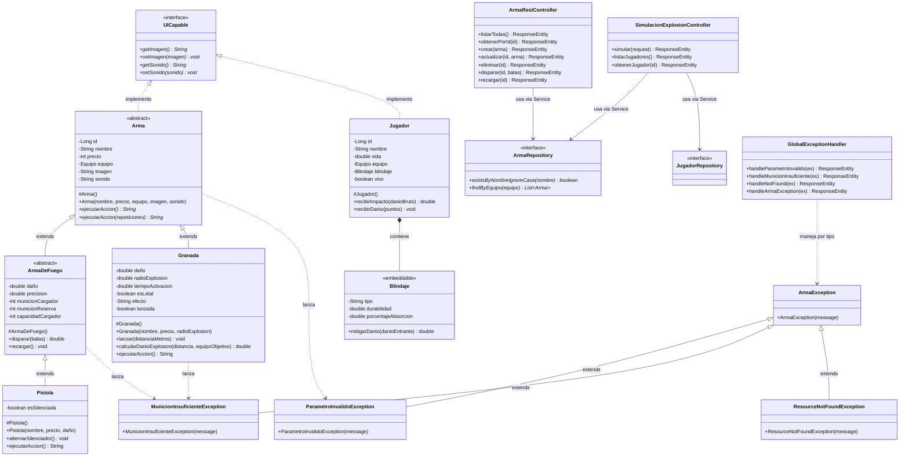

# menciso-tp-lp3-2026

**Asignatura:** Lenguaje de Programación 3 (CYT646) — Edición 2026  
**Ejercicio:** POO-08 (CRUD REST, H2, reglas de juego, simulación persistida, excepciones e Insomnia)  
**Dominio:** Counter-Strike 2 (CS2)  
**Autor:** Matias Enciso  
**Licencia:** [Apache License 2.0](LICENSE)  

---

## 1. Cómo Arrancar el Servicio y Propiedades de H2

### Arranque del proyecto
Desde la carpeta `cs2` del repositorio:

```bash
cd cs2
./mvnw spring-boot:run
```

El servicio levanta en `http://localhost:8080` y precarga automáticamente un arsenal inicial de armas (`Pistola`, `Granada`, `RifleAsalto`) y dos jugadores (`s1mple (CT)` y `Phoenix (T)`) con su blindaje en H2 si la base está vacía.

### Propiedades de H2 explicadas (`src/main/resources/application.properties`)
* `spring.application.name=menciso-tp-lp3-2026`: Define el nombre identificador de la aplicación dentro de Spring Boot.
* `spring.datasource.url=jdbc:h2:file:./data/armas;AUTO_SERVER=TRUE`: Configura H2 para guardar los datos en disco dentro de `./data/armas` (para que no se pierdan al reiniciar) y permite conexiones concurrentes.
* `spring.datasource.driverClassName=org.h2.Driver`: Especifica el driver JDBC oficial del motor H2.
* `spring.datasource.username=sa`: Define el usuario administrador por defecto de la base de datos local.
* `spring.datasource.password=`: Deja la contraseña vacía para el entorno de desarrollo local.
* `spring.jpa.database-platform=org.hibernate.dialect.H2Dialect`: Indica a Hibernate que genere sentencias SQL adaptadas al dialecto de H2.
* `spring.jpa.hibernate.ddl-auto=update`: Hace que Hibernate cree o actualice automáticamente las tablas (`armas` y `jugadores`) a partir de las clases `@Entity` sin borrar los datos existentes.
* `spring.jpa.open-in-view=false`: Desactiva el patrón Open Session in View para cerrar las sesiones de base de datos apenas termina la transacción del servicio.
* `spring.h2.console.enabled=true`: Habilita la consola visual web de H2 para inspeccionar las tablas desde el navegador.
* `spring.h2.console.path=/h2-console`: Define la ruta URL (`http://localhost:8080/h2-console`) donde se accede a la consola H2.

---

## 2. Diagrama de Clases Actualizado (Mermaid)

El diagrama muestra:
* **Herencia (`<|--`):** La familia principal `Arma` -> `ArmaDeFuego` / `Granada` -> `Pistola`, y la jerarquía de excepciones `ArmaException` -> `ParametroInvalidoException` / `MunicionInsuficienteException` / `ResourceNotFoundException`.
* **Implementación de Interfaz (`<|..`):** `UICapable` implementada por dos familias distintas (`Arma` y `Jugador`).
* **Uso de Repositorio (`-->`):** Los servicios y controladores dependen de las interfaces `ArmaRepository` y `JugadorRepository` de Spring Data JPA.
* **Jerarquía de Excepciones (`..>`):** Las clases de dominio lanzan excepciones específicas y `GlobalExceptionHandler` las traduce a respuestas HTTP por tipo.


```mermaid
classDiagram
    class UICapable {
        <<interface>>
        +getImagen()* String
        +setImagen(imagen)* void
        +getSonido()* String
        +setSonido(sonido)* void
    }

    class Arma {
        <<abstract>>
        -Long id
        -String nombre
        -int precio
        -Equipo equipo
        -String imagen
        -String sonido
        #Arma()
        +Arma(nombre, precio, equipo, imagen, sonido)
        +ejecutarAccion()* String
        +ejecutarAccion(repeticiones)* String
    }

    class ArmaDeFuego {
        <<abstract>>
        -double daño
        -double precision
        -int municionCargador
        -int municionReserva
        -int capacidadCargador
        #ArmaDeFuego()
        +disparar(balas) double
        +recargar() void
    }

    class Pistola {
        -boolean esSilenciada
        #Pistola()
        +Pistola(nombre, precio, daño)
        +alternarSilenciador() void
        +ejecutarAccion() String
    }

    class Granada {
        -double daño
        -double radioExplosion
        -double tiempoActivacion
        -boolean esLetal
        -String efecto
        -boolean lanzada
        #Granada()
        +Granada(nombre, precio, radioExplosion)
        +lanzar(distanciaMetros) void
        +calcularDanioExplosion(distancia, equipoObjetivo) double
        +ejecutarAccion() String
    }

    class Jugador {
        -Long id
        -String nombre
        -double vida
        -Equipo equipo
        -Blindaje blindaje
        -boolean vivo
        #Jugador()
        +recibirImpacto(danioBruto) double
        +recibirDanio(puntos) void
    }

    class Blindaje {
        <<embeddable>>
        -String tipo
        -double durabilidad
        -double porcentajeAbsorcion
        +mitigarDanio(danioEntrante) double
    }

    class ArmaRepository {
        <<interface>>
        +existsByNombreIgnoreCase(nombre)* boolean
        +findByEquipo(equipo)* List~Arma~
    }

    class JugadorRepository {
        <<interface>>
    }

    class ArmaRestController {
        +listarTodas() ResponseEntity
        +obtenerPorId(id) ResponseEntity
        +crear(arma) ResponseEntity
        +actualizar(id, arma) ResponseEntity
        +eliminar(id) ResponseEntity
        +disparar(id, balas) ResponseEntity
        +recargar(id) ResponseEntity
    }

    class SimulacionExplosionController {
        +simular(request) ResponseEntity
        +listarJugadores() ResponseEntity
        +obtenerJugador(id) ResponseEntity
    }

    class ArmaException {
        +ArmaException(message)
    }

    class ParametroInvalidoException {
        +ParametroInvalidoException(message)
    }

    class MunicionInsuficienteException {
        +MunicionInsuficienteException(message)
    }

    class ResourceNotFoundException {
        +ResourceNotFoundException(message)
    }

    class GlobalExceptionHandler {
        +handleParametroInvalido(ex) ResponseEntity
        +handleMunicionInsuficiente(ex) ResponseEntity
        +handleNotFound(ex) ResponseEntity
        +handleArmaException(ex) ResponseEntity
    }

    UICapable <|.. Arma : implements
    UICapable <|.. Jugador : implements
    Arma <|-- ArmaDeFuego : extends
    Arma <|-- Granada : extends
    ArmaDeFuego <|-- Pistola : extends
    Jugador *-- Blindaje : contiene
    ArmaRestController --> ArmaRepository : usa via Service
    SimulacionExplosionController --> ArmaRepository : usa via Service
    SimulacionExplosionController --> JugadorRepository : usa via Service
    ArmaException <|-- ParametroInvalidoException : extends
    ArmaException <|-- MunicionInsuficienteException : extends
    ArmaException <|-- ResourceNotFoundException : extends
    Arma ..> ParametroInvalidoException : lanza
    ArmaDeFuego ..> MunicionInsuficienteException : lanza
    Granada ..> MunicionInsuficienteException : lanza
    GlobalExceptionHandler ..> ArmaException : maneja por tipo
```

---

## 3. Las Dos Reglas de Negocio y la Simulación Persistida

En la simulación participan **tres clases del modelo** (`Granada`/`Pistola` de la familia `Arma`, `Jugador` y `Blindaje`):

1. **Regla 1 (Consumo de carga/munición y cálculo de daño en `Granada` y `ArmaDeFuego`):** Al disparar un arma de fuego o detonar una granada se descuenta munición del cargador (o se consume la carga única de la granada calculando la atenuación por distancia al epicentro y reduciendo el daño al 35% si hay fuego amigo), lanzando `MunicionInsuficienteException` si el arma ya no tiene balas o si la granada ya fue detonada.
2. **Regla 2 (Mitigación e impacto por Kevlar en `Blindaje` y `Jugador`):** Antes de descontar puntos de salud al `Jugador`, su `Blindaje` absorbe un porcentaje del daño entrante desgastando su propia durabilidad, y solo el daño residual impacta en la vida del jugador (cambiando su estado a eliminado si llega a `0 HP`).

Ambas reglas se ejecutan dentro de los métodos del dominio (`granada.lanzar()`, `granada.calcularDanioExplosion()`, `armaDeFuego.disparar()`, `blindaje.mitigarDanio()` y `jugador.recibirImpacto()`) y el nuevo estado de `Arma` y `Jugador` **se guarda en H2**.

---

## 4. Respuestas a «Qué hay que pensar»

* **Recurso y verbo:** El sustantivo principal de nuestra API es `/api/armas` (y `/api/simulacion/explosion` para la simulación). La URL nombra al recurso en plural y el verbo HTTP (`GET`, `POST`, `PUT`, `DELETE`) define la acción que se realiza sin poner verbos como `/crearArma` en la ruta REST del CRUD.
* **Identidad:** La clave primaria es el campo `id` (`Long`), anotado con `@Id` y `@GeneratedValue(strategy = GenerationType.IDENTITY)`. La asigna automáticamente la base de datos H2 al insertar la fila, por lo que el JSON del `POST` omite el `id` (y si alguien envía un `id` en el `POST`, el servicio lo rechaza con error 400).
* **Herencia y tablas:** Elegimos `InheritanceType.SINGLE_TABLE` con la columna discriminadora `tipo_arma` en la tabla `armas` porque en CS2 todas las armas comparten la mayoría de los atributos base y consultar todo el arsenal en una sola tabla evita hacer múltiples `JOIN` innecesarios. En el JSON el subtipo se distingue mediante `@JsonTypeInfo` y `@JsonSubTypes` con la propiedad `"tipo"` (`"Pistola"`, `"Granada"`, `"RifleAsalto"`, etc.).
* **Interfaz y repositorio:** `ArmaRepository` y `JugadorRepository` son interfaces que extienden `JpaRepository`. Al depender de una interfaz, el servicio y el controller se desacoplan del código SQL y de cómo se guarda la información, cumpliendo el mismo principio de programación contra un protocolo visto en POO-07.
* **Protocolo del dominio:** Nuestra interfaz de dominio es `UICapable` (`getImagen()`, `getSonido()`). La usa el endpoint `GET /armas/catalogo-ui`, el cual junta en una misma lista `List<UICapable>` instancias persistidas de dos familias distintas (`Arma` y `Jugador`) y las recorre polimórficamente sin importar su jerarquía.
* **Ocultamiento:** Las reglas numéricas las sostienen las propias clases del dominio (`Arma`, `ArmaDeFuego`, `Granada`, `Jugador`, `Blindaje`) en sus constructores y setters, mientras que el constructor vacío requerido por JPA es `protected` para que nadie fuera del paquete instancie objetos incompletos. El pedido `6. POST ilegal - Precio negativo (400)` en Insomnia prueba que enviar `"precio": -500` lanza `ParametroInvalidoException` y deja la tabla `armas` intacta.
* **PUT y PATCH:** Implementamos `PUT /api/armas/{id}`, que actualiza el recurso validando primero sus invariantes. Si ciertos campos opcionales como `imagen`, `sonido` o `activo` se omiten en el JSON, se conservan los valores válidos que ya tenía la entidad o sus valores por defecto seguros.
* **DELETE:** En nuestro modelo, `DELETE /api/armas/{id}` elimina físicamente el registro del arsenal en H2 tras verificar con `obtenerPorId(id)` que el arma existe, respondiendo `204 No Content` (o `404 Not Found` si no existe).
* **Dos reglas:** Los dos hechos que cambian el estado de más de un objeto a la vez son: (1) el disparo/detonación del arma que gasta munición o marca la granada como detonada en H2, y (2) la absorción del impacto por el blindaje Kevlar que reduce la durabilidad del chaleco y descuenta la vida del jugador. El recurso HTTP es `/api/simulacion/explosion`, y al hacer un `GET /api/simulacion/explosion/jugadores/1` o `GET /api/armas/3` posterior se ve el resultado persistido en H2.
* **Excepciones:** La clase base es `ArmaException` (hereda de `RuntimeException`, no comprobada, para que las reglas del dominio corten la transacción limpiamente sin ensuciar las firmas de los métodos con `throws`). Sus hijas son `ParametroInvalidoException` (cuando se viola un invariante numérico o de construcción, responde `400 Bad Request`), `MunicionInsuficienteException` (cuando se intenta disparar sin balas, recargar sin reserva o detonar dos veces una granada, responde `409 Conflict`) y `ResourceNotFoundException` (cuando un `id` no existe en H2, responde `404 Not Found`). El JSON de error devuelve `timestamp`, `status`, `error`, `tipoExcepcion` y `mensaje`.
* **Preguntas de anclaje:**
  1. *¿Si mañana cambiamos H2 por otra base, qué archivos tocan y cuáles se quedan quietos?* Solo se tocan `pom.xml` (para agregar el driver de la nueva base, por ejemplo PostgreSQL) y `application.properties` (URL, dialecto y credenciales). Todas las clases de `domain`, `repository`, `service` y `rest.controller` se quedan quietas.
  2. *¿Quién lanza la excepción, el controller o el objeto del juego?* La lanza el objeto del juego en el paquete `domain` (por ejemplo `Arma`, `ArmaDeFuego`, `Granada`, `Jugador`, `Blindaje`) cuando intentan dejarlo en un estado inválido; el controller solo recibe el pedido HTTP y `GlobalExceptionHandler` traduce la excepción a JSON.

---

## 5. Cómo Importar y Recorrer la Colección de Insomnia

La colección exportada se encuentra versionada en:  
`insomnia/insomnia-cs2-poo08.json`

### Pasos para importar
1. Abrir **Insomnia**.
2. Ir a **Import** -> **From File** y seleccionar `insomnia/insomnia-cs2-poo08.json`.
3. Verificar que el entorno **Base Environment** esté activo (define `base_url = http://localhost:8080`).

### Orden recomendado de ejecución (Carpeta `me-taller-lp3` -> `cs2`)
1. **`1. Crear armas (POST)`** (`POST /api/armas`): Crea la pistola `Five-SeveN` en H2 y devuelve `201 Created` con su `id`.
2. **`2. Obtener todas las armas (GET)`** (`GET /api/armas`): Lista todas las armas guardadas en H2 incluyendo la recién creada.
3. **`3. Obtener arma por id (GET)`** (`GET /api/armas/1`): Devuelve el detalle de la `Glock-18` con `id = 1`.
4. **`4. Editar armas (PUT)`** (`PUT /api/armas/1`): Actualiza el nombre y precio del arma `1` a `Glock-18 Water Elemental`. Un `GET` posterior confirma que el cambio quedó persistido.
5. **`5. Eliminar armas (DELETE)`** (`DELETE /api/armas/6`): Borra el arma con `id = 6` y devuelve `204 No Content`.
6. **`6. POST ilegal - Precio negativo (400)`** (`POST /api/armas`): Envía `"precio": -500`, recibe `400 Bad Request` y demuestra que no se guardó basura en H2.
7. **`7. Obtener id inexistente (404)`** (`GET /api/armas/999`): Prueba la búsqueda de un ID inexistente y recibe `404 Not Found`.
8. **`8. Endpoint Interfaz UICapable (GET)`** (`GET /armas/catalogo-ui`): Devuelve tanto las instancias de `Arma` como las de `Jugador` persistidas en H2 usando la interfaz `UICapable`.
9. **`9. Simulación Persistida en H2 (POST)`** (`POST /api/simulacion/explosion`): Ejecuta la simulación con la `Granada HE` (`armaId: 3`) sobre el jugador `s1mple (CT)` (`jugadorId: 1`) a 2 metros, aplicando las dos reglas de negocio y guardando el resultado en H2.
10. **`10. Verificar Jugador en H2 tras Simulación (GET)`** (`GET /api/simulacion/explosion/jugadores/1`): Muestra que la vida de `s1mple (CT)` bajó de `100.0` a `63.25` y la durabilidad de su blindaje Kevlar bajó en la base de datos.
11. **`11. Excepción Hija 1 - ParametroInvalidoException (400)`** (`POST /api/armas/1/disparar?balas=-3`): Provoca la primera excepción hija enviando una cantidad inválida de balas (`400 Bad Request`).
12. **`12. Excepción Hija 2 - MunicionInsuficienteException (409)`** (`POST /api/armas/3/recargar`): Provoca la segunda excepción hija al intentar recargar una granada o usar un arma sin munición disponible (`409 Conflict`).

---

## 6. Enlace al Commit de la Solución
* **Repositorio:** [https://github.com/MatiasEnc/menciso-tp-lp3-2026](https://github.com/MatiasEnc/menciso-tp-lp3-2026)
* **Commit de la solución:** [https://github.com/MatiasEnc/menciso-tp-lp3-2026/commit/cecf2ac9b1c7c197fe160e626e71e0a1dd52ccf0](https://github.com/MatiasEnc/menciso-tp-lp3-2026/commit/cecf2ac9b1c7c197fe160e626e71e0a1dd52ccf0)
